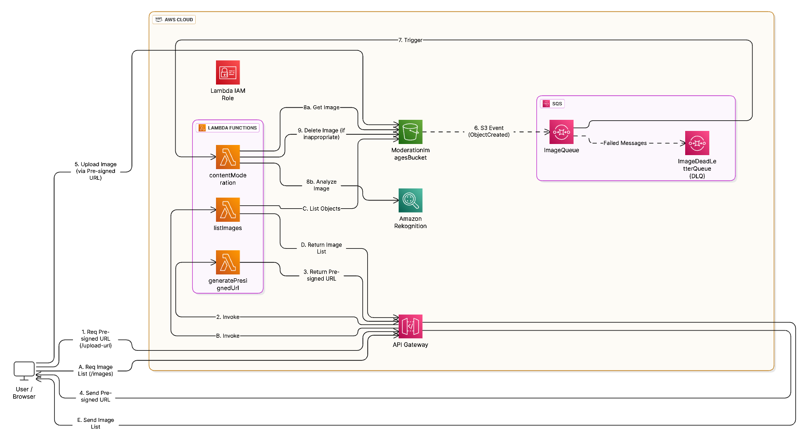

# Content Moderation System

A full-stack AWS-powered content moderation system that automatically analyzes and filters inappropriate images using machine learning.

## 📚 Documentation & Resources

### Architecture Diagram


### Detailed Presentation
📋 [Complete Tutorial: How to Build a Serverless Content Moderation System with AWS](how_to_build_a_serverless_content_moderation_system_with_aws.pdf)

This comprehensive slide presentation includes:
- Step-by-step implementation guide
- AWS service configurations and best practices
- Troubleshooting tips and common issues
- Advanced optimization techniques
- Cost optimization strategies

## 🏗️ Architecture

This project consists of two main components:

### Backend (Serverless AWS)

- **AWS Lambda** - Serverless functions for content processing
- **AWS Rekognition** - AI-powered image content analysis
- **AWS S3** - Image storage and event triggers
- **AWS SQS** - Message queuing for reliable processing
- **API Gateway** - RESTful API endpoints

### Frontend (Next.js)

- **Next.js 15** - React-based web application
- **TypeScript** - Type-safe development
- **Tailwind CSS** - Modern styling
- **Real-time Updates** - Live image gallery

## 🚀 Quick Start

### Prerequisites

- Node.js 18+ installed
- AWS CLI configured with appropriate permissions
- Serverless Framework CLI installed globally

### 1. Deploy Backend

```bash
cd backend
npm install
serverless deploy
```

### 2. Start Frontend

```bash
cd frontend
npm install
npm run dev
```

Visit `http://localhost:3000` to see the application.

## 📁 Project Structure

```
content-moderation/
├── backend/                 # Serverless AWS backend
│   ├── src/lambdas/        # Lambda function handlers
│   ├── serverless.yml      # Infrastructure as Code
│   └── package.json
├── frontend/               # Next.js web application
│   ├── app/               # App Router pages & components
│   ├── public/            # Static assets
│   └── package.json
└── README.md              # This file
```

## 🔧 Configuration

### Backend Configuration

The backend deploys to `eu-west-1` by default. You can modify the region and other settings in `backend/serverless.yml`.

### Frontend Configuration

Update the API endpoint in `frontend/app/page.tsx` after backend deployment:

```typescript
const API_BASE_URL = "YOUR_API_GATEWAY_URL";
```

## 🔍 How It Works

1. **Upload**: Users upload images through the web interface
2. **Storage**: Images are stored in an S3 bucket
3. **Trigger**: S3 events trigger SQS messages
4. **Analysis**: Lambda functions process images using AWS Rekognition
5. **Moderation**: Inappropriate content is automatically flagged/removed
6. **Display**: Approved images are shown in the gallery

## 📊 Monitoring & Logging

### Live Log Monitoring

Monitor your content moderation pipeline in real-time:

```bash
# Monitor content moderation Lambda function logs
cd backend
npm run logs

# Alternative: Direct serverless commands
serverless logs --function contentModeration --tail
serverless logs --function generatePresignedUrl --tail
serverless logs --function listImages --tail

# View historical logs (last 1 hour)
serverless logs --function contentModeration --startTime 1h

# Monitor specific log groups with AWS CLI
aws logs tail /aws/lambda/content-moderation-demo-dev-contentModeration --follow
aws logs tail /aws/lambda/content-moderation-demo-dev-generatePresignedUrl --follow
```

### CloudWatch Dashboard

- **CloudWatch Logs**: Monitor Lambda function execution and debugging
- **SQS Dead Letter Queue**: Track failed processing attempts and retry patterns
- **S3 Events**: Audit image uploads, deletions, and bucket activity
- **Rekognition Metrics**: Content moderation confidence scores and detection rates

## 🛡️ Content Moderation

The system detects various types of inappropriate content:

- Explicit Nudity
- Violence
- Hate Symbols
- Suggestive Content
- Disturbing Content

Confidence threshold is configurable (default: 80%).

## 🧹 Cleanup

To remove all AWS resources:

```bash
cd backend
# First empty the S3 bucket manually
serverless remove
```
